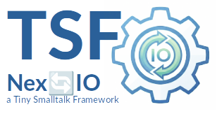

|<sub>🇬🇧 [English translation →](README.en.md)</sub>|
|----:|
|    |

|[](https://pharo.org)|[](./LICENSE) [](#)|
|----|----|
|| ***TSF-NexIO***<br>Ein leichtgewichtiges, robustes Framework für JSON-RPC 2.0 Kommunikation über WebSockets in Pharo Smalltalk. Teil der **Tiny Smalltalk Framework Suite**|

<sup>***TSF*** steht für ***Tiny Smalltalk Framework*** — eine Sammlung von minimalistischen Tools für robuste Anwendungen.</sup>


## Übersicht

**TsfNexIO - JSON-RPC 2.0 over WebSockets** ist ein leichtgewichtiges, robustes Framework für JSON-RPC 2.0 Kommunikation über WebSockets in Pharo Smalltalk. Es wurde entwickelt, um **synchrone Semantik auf asynchronen Kanälen** zu ermöglichen und bietet eine strikte Trennung von Transport (Server) und Logik (Delegate).

## Features

  * **JSON-RPC 2.0 Konformität:** Volle Unterstützung für Requests, Notifications und **Batch Requests**.
  * **Synchroner Client:** Blockierende Aufrufe (`sendSynchronous:...`), die sich anfühlen wie lokale Methodenaufrufe.
  * **Thread-Safety:** Sicherer Betrieb in nebenläufigen Umgebungen (Monitor/Mutex geschützt).
  * **Auto-Heartbeat:** Erkennt und bereinigt "tote" Verbindungen automatisch.
  * **Reflection Dispatch:** Keine manuellen `if/else` Kaskaden – Methoden werden automatisch gemappt.


## Highlight: Batch Requests

TsfNexIO unterstützt **Batch Requests** "out of the box". Das erlaubt es dem Client, mehrere Methodenaufrufe in einem einzigen Netzwerk-Paket zu senden. Der Server verarbeitet alle parallel (oder sequenziell) und sendet die Ergebnisse gesammelt zurück.

**Warum ist das wichtig?**
Massive Reduzierung der Latenz bei vielen kleinen Anfragen (z.B. Initial-Ladung von Daten).

```smalltalk
| batch requests results |
client connectTo: 'ws://localhost:9090'.

"1. Mehrere Requests sammeln"
requests := OrderedCollection new.
requests add: 'math.add' -> {'a' -> 10. 'b' -> 20} asDictionary.
requests add: 'math.sub' -> {'a' -> 100. 'b' -> 50} asDictionary.
requests add: 'system.ping' -> Dictionary new.

"2. In einem Rutsch senden"
results := client sendBatch: requests.

"3. Ergebnisse auswerten"
(results first at: 'result') inspect. "30"
(results second at: 'result') inspect. "50"
```

## Architektur & Usage

### Server starten (Delegate Pattern)

Der Server delegiert die Logik an eine App-Klasse. Das Routing basiert auf Namenskonventionen (`rpc` + MethodName + `:session:`).

```smalltalk
"Server starten"
server := TsfNexIOServer new.
server delegate: MyChatApp new.
server startOn: 9090.
```

### Delegate Implementierung 

| JSON Methode | Pharo Selector im Delegate |
| :--- | :--- |
| `auth.login` | `rpcAuthLogin: params session: session` |
| `chat.send` | `rpcChatSend: params session: session` |

<sup>[Warum wir *"dotted method notation"* benutzen](dotted-methods.de.md)</sup>

```smalltalk
MyChatApp >> rpcAuthLogin: params session: aSession
    | user |
    user := params at: 'username'.
    aSession user: user.
    ^ {'status' -> 'logged_in'} asDictionary
```

## Installation

```smalltalk
Metacello new
    baseline: 'TsfNexIO';
    repository: 'github://georghagn/TSF-NexIO:main';
    load.
```

## Hintergrund: Der Name "TsfNexIO"

Der Name setzt sich aus zwei Komponenten zusammen, die die Philosophie des Frameworks widerspiegeln:

  * **Tsf:** Steht für **Tiny Smalltalk Framework**. Es unterstreicht den Anspruch, klein, verständlich und ohne unnötigen Ballast zu sein – ganz im Sinne der Smalltalk-Philosophie.
  * **NexIO:** Steht für **Nex**t Generation **I/O**. Es symbolisiert den modernen Ansatz, asynchrone Ein-/Ausgabe (WebSockets) so zu kapseln, dass sie einfach und logisch nutzbar ist.


## Entwicklungsprozess & Credits

Ein besonderer Dank gilt meinem KI-Sparringspartner für die intensiven und wertvollen Diskussionen während der Entwurfsphase. Die Fähigkeit der KI, verschiedene Architekturansätze schnell zu skizzieren und Vor- und Nachteile abzuwägen, hat die Entwicklung von `TSF-NexIO` erheblich beschleunigt und die Robustheit des Endergebnisses verbessert.


## License

Dieses Projekt steht unter der Apache 2.0 Lizenz. Siehe LICENSE.


## Kontakt

Bei Fragen oder Interesse an diesem Projekt erreichen Sie mich unter:   
📧 *georghagn [at] tiny-frameworks.io*

<sup>*(Bitte keine Anfragen an die privaten GitHub-Account-Adressen)*</sup>
